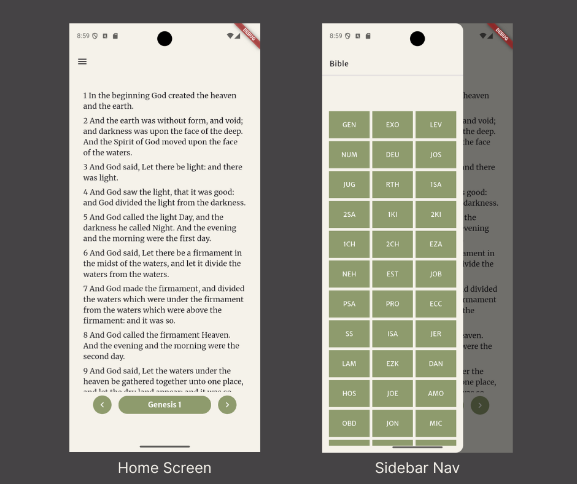

# My Bible
#### A personal Bible application built with Flutter



## Description

This application is a Bible Reader that can be used to navigate to different scriptures.
It has a built-in SQLite database with the Bible but it is - `incomplete`

## Features
* Home Screen - shows one chapter at a time.
    * Lower navigation - shows the current book and chapter and the chevron icon buttons allow
    for navigation to the next and previous chapter.
* Sidebar - lists all the books of the Bible. When a book is tapped the list of chapters for that
    book is shown. When the chapter is tapped the list of verses for that chapter is shown.

* Tapping on the verse shows the selected portion of scripture.

## Installation Guide

Before beginning with the installation, you will need the following with the mentioned versions

* Android Studio Meerkat | 2024.3.1 Patch 1
* Flutter Version - 3.29.2
* Dart - 3.7.2

### Clone the repository

Clone this project via GitHub or download a ZIP

###### HTTPS
```
https://github.com/kristovr/mybible.git
```
###### SSH
```
git@github.com:kristovr/mybible.git
```

### Install dependencies
* `cd` to the project's location via a terminal.
* Run the following command to install the required packages.
```
flutter pub get
```

### Connect a device or an emulator
* Physical Device
    * Enable USB debugging on your device.
    * Connect the device to your computer using a USB cable.

* Emulator
    * Start an Android emulator via Android Studio or through an IDE.

### Run the project

* `cd` to the project's location via a terminal and run the following:
```
flutter run
```
* You can also run the project through an IDE.

## More Information

You can find more resources here on the flutter website.
A few resources to get you started if this is your first Flutter project:

- [Lab: Write your first Flutter app](https://docs.flutter.dev/get-started/codelab)
- [Cookbook: Useful Flutter samples](https://docs.flutter.dev/cookbook)

For help getting started with Flutter development, view the
[online documentation](https://docs.flutter.dev/), which offers tutorials,
samples, guidance on mobile development, and a full API reference.
